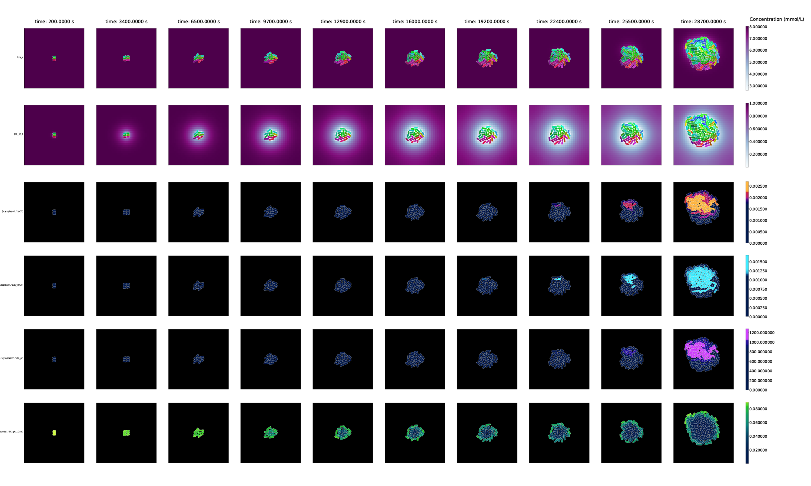

# vivarium-cell
[vivarium-cell](https://github.com/vivarium-collective/vivarium-cell) is a library of configurable
 cell process and composites for vivarium projects.



# Installation
vivarium-cell can be used as a python library. To install:
```
$ pip install vivarium-cell
```

# Setup in local repository
Clone the repository, make a python environment, and install dependencies. 

First install numpy:
```
$ pip install numpy
```

Then the remaining requirements:
```
$ pip install -r requirements.txt
```

# Run individual processes and composites
Each process file under `cell/processes` can run on its own. Some of these have their own command line options.
For example, call the `convenience_kinetics` process with:
```
$ python vivarium_cell/processes/convenience_kinetics.py
```

Composites with multiple integrated processes can also be executed on their own:
```
$ python vivarium_cell/composites/gene_expression.py
```

# Experiments
TODO

# Tests
Tests are performed with pytest. Simply call the following to ensure everything is working properly:
```
$ pytest
```

To run only the fast tests:
```
$ pytest -m 'not slow'
```

# Logging
Logging is done with python logging. To print out logging information, run a simulation with:
```
$ LOGLEVEL=INFO python vivarium_cell/..
```